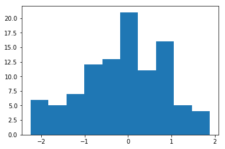
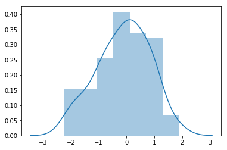
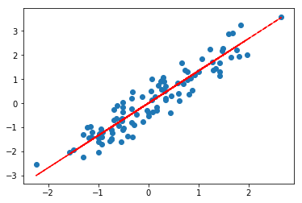

### Import packages 
`import matplotlib.pyplot as plt
 `
`import seaborn as sns`

### 1. Create fake data from normal distribution with 100 observations

`use numpy random.normal`

### 2. Plot a histogram to see the distribution using matplotlib

### 3.switch to seaborn and add a smooth distribution line on top of histogram 

### 4. add titles to plots and save them in your visualizations folder using python commands

### 5. lets create now a fake linear regression data
- create weights (only one here!) and noise (give 0.1 as std for noise) from random normal as well 
-  apply y = w*x + noise 

### 6. create a scatter plot of x to y
### 7. plot above the regression line

### 8. Calculate without any library the mean squared error 

### 9. Plot the noise with respect to the predicators - this is a plot to chek 
-  if the x's are independent from the errors - so for linear regression model to hold we need it to look like a scattered cloud  

### 10. Push all to your github branch

### 11. [optional] Create functions for the different steps in this warm-up (e.g. def x_from_standard_normal)

### 12. [optional] Create a new array the same size as x and append them together                - Adjust y equation accordingly
