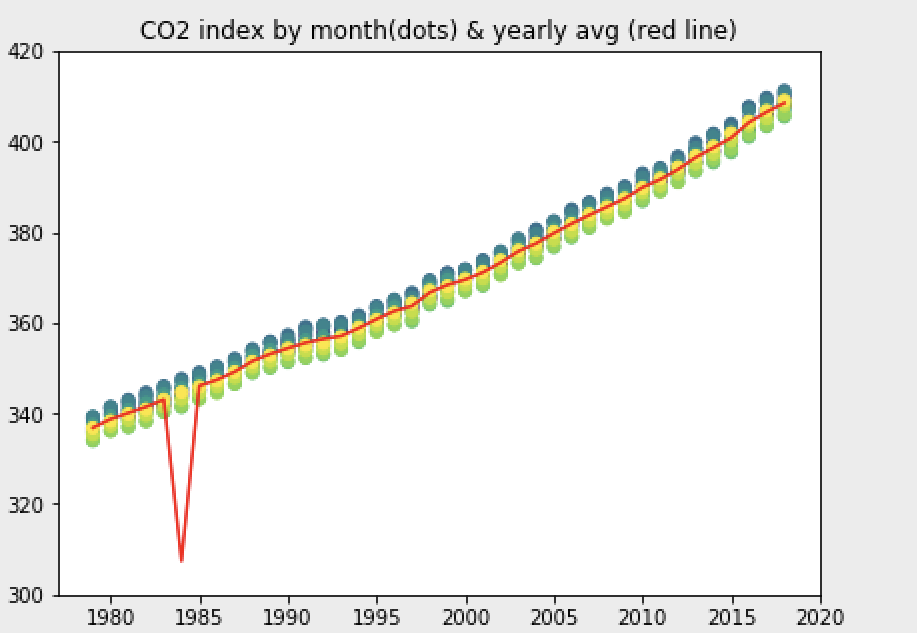

### Import packages

`import matplotlib.pyplot as plt`

`from IPython.display import Image`

### 1. open the notebook with the CO2 data
- last time we picked columns 0, 1 and 3. Choose this time columns 0, 1, 3 and 4.
- Whenever there is a missing value (-99.99) replace it with the corresponding value at column 4.

### 2. 
 - Create a new directory in your documents folder
 name it visualizations 
 - in it create a folder named warm-up-mod1
- list all folders in your documents folder 
`use ls`

### 3. Using matplotlib we want to create the following figure : 

- Each month is signaled by different colour 
- Add an yearly average (red) (use groupby with mean)
- Notice the starting year on the x-axis
- Notice the range on the Y-axis

### 4. Push your notebook to your github branch 

### 5. save your image into the visualizations folder we have created 

`plt.savefig`

#### [optional] Play with the scales of axis to make the difference among months more apparent
